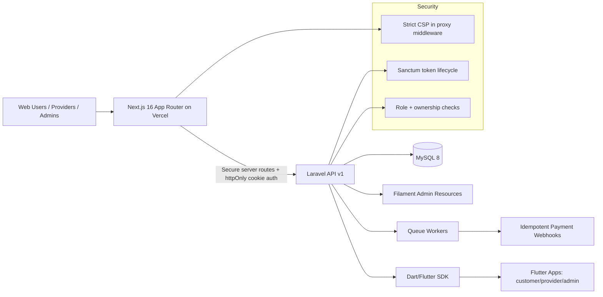

# PearlHub — Sri Lanka's Multi-Vertical Marketplace Platform

> A unified platform connecting providers and customers across five service verticals in Sri Lanka: **Property**, **Stays**, **Vehicles**, **Events**, and **SME Food & Services**.

---

## Platform Overview

| Layer | Technology | Purpose |
|---|---|---|
| **API Backend** | Laravel 11 + PostgreSQL | REST API, auth, payments, escrow |
| **Web Frontend** | Next.js 16 + TypeScript | Customer-facing marketplace |
| **Provider App** | Flutter (Android/iOS) | Business owner dashboard |
| **Admin App** | Flutter (Android/iOS) | Platform operations & moderation |
| **Shared SDK** | `pearl_core` Dart package | API client, auth, shared models |

---

## Architecture Diagram



---

## Repository Structure

```
pearlhublklarav/
├── app/                          # Laravel — controllers, models, services
│   ├── Http/Controllers/Api/V1/  # REST API controllers
│   ├── Http/Middleware/          # EnsureAdminRole, etc.
│   ├── Models/                   # Eloquent models (UUID-first)
│   └── Services/                 # Business logic
├── database/
│   ├── migrations/               # 19 migrations (users → reviews)
│   ├── factories/                # ListingFactory, ReviewFactory
│   └── seeders/                  # DatabaseSeeder, ListingSeeder
├── routes/api.php                # All v1 API routes
├── web-nextjs/                   # Next.js 16 web app
│   ├── app/                      # App Router pages
│   ├── components/               # Reusable UI components
│   └── lib/                      # API client, types
└── flutter-monorepo/
    ├── packages/pearl_core/      # Shared Dart SDK (Dio, Sanctum)
    └── apps/
        ├── customer/             # Customer marketplace app
        ├── provider/             # Provider business app
        └── admin/                # Admin command center
```

---

## API Endpoints (v1)

### Public
```
GET  /api/v1/health
GET  /api/v1/listings              # Browse all listings (filterable)
GET  /api/v1/listings/{id}         # Listing detail
GET  /api/v1/listings/{id}/reviews # Listing reviews
GET  /api/v1/search                # Full-text + geo search
POST /api/v1/auth/register
POST /api/v1/auth/login
POST /api/v1/auth/logout
```

### Authenticated (Sanctum)
```
GET  /api/v1/listings/my           # Provider's own listings
POST /api/v1/listings              # Create listing
PUT  /api/v1/listings/{id}         # Update listing
GET  /api/v1/users/profile         # Get profile
PUT  /api/v1/users/profile         # Update profile
POST /api/v1/listings/{id}/reviews # Post a review
POST /api/v1/bookings
PUT  /api/v1/bookings/{id}
POST /api/v1/taxi-rides
POST /api/v1/listings/{id}/verify  # Submit for verification
```

### Admin Only (role: admin)
```
GET /api/v1/admin/stats
GET /api/v1/admin/users
PUT /api/v1/admin/users/{id}       # Toggle is_active
```

---

## Database Schema (Key Tables)

| Table | Key Fields |
|---|---|
| `users` | id (UUID), full_name, email, role, is_active |
| `profiles` | user_id, bio, avatar_url, id_verified |
| `listings` | id (UUID), title, slug, vertical, provider_id, status, lat, lng, price |
| `reviews` | id (UUID), listing_id, reviewer_id, rating (3.1), body |
| `bookings` | id (UUID), listing_id, customer_id, status, price_snapshot |
| `taxi_rides` | id (UUID), origin, destination, fare, status |
| `wallets` | user_id, balance, currency |
| `escrows` | booking_id, amount, released_at |

---

## Local Setup

### Backend (Laravel)

**Requirements:** PHP 8.2+, Composer, PostgreSQL 15+

```bash
# 1. Install dependencies
composer install

# 2. Configure environment
cp .env.example .env
# Edit .env: DB_*, SANCTUM_STATEFUL_DOMAINS, etc.

# 3. Generate key & migrate
php artisan key:generate
php artisan migrate
php artisan db:seed

# 4. Serve
php artisan serve
# → http://localhost:8000/api/v1/health
```

**Test credentials (seeded):**
| Role | Email | Password |
|---|---|---|
| Admin | admin@pearlhub.lk | secret123 |
| Provider | provider1@pearlhub.lk | secret123 |
| Customer | customer1@pearlhub.lk | secret123 |

### Web Frontend (Next.js)

```bash
cd web-nextjs
cp .env.local.example .env.local
# Set NEXT_PUBLIC_API_URL=http://localhost:8000/api/v1
npm install
npm run dev
# → http://localhost:3000
```

### Flutter Apps

```bash
cd flutter-monorepo

# Install shared SDK
cd packages/pearl_core && flutter pub get && cd ../..

# Customer app
cd apps/customer
flutter pub get
flutter run --dart-define=API_URL=http://10.0.2.2:8000/api/v1

# Provider app
cd apps/provider
flutter pub get
flutter run --dart-define=API_URL=http://10.0.2.2:8000/api/v1

# Admin app
cd apps/admin
flutter pub get
flutter run --dart-define=API_URL=http://10.0.2.2:8000/api/v1
```

> Use `10.0.2.2` for Android emulator to reach host localhost.

---

## Deployment

### Next.js → Vercel

```bash
cd web-nextjs
npx vercel --prod
```

Set in Vercel dashboard:
- `NEXT_PUBLIC_API_URL` → `https://api.pearlhub.lk/api/v1`

### Laravel → Server (Forge / Railway / VPS)

```bash
composer install --no-dev --optimize-autoloader
php artisan key:generate
php artisan migrate --force
php artisan db:seed --force
php artisan config:cache
php artisan route:cache
```

### Laravel -> Contabo with aaPanel (Quick One-Click)

Use this option when you want fast MySQL/PHP/Nginx setup and simple backup management.

1. Create a clean Ubuntu VPS on Contabo.
2. Install aaPanel from the official installer.
3. In aaPanel App Store, install:
    - `Nginx`
    - `MySQL` (or MariaDB)
    - `PHP 8.3+`
    - `phpMyAdmin`
4. In aaPanel, create:
    - Site for your API domain (for example `api.yourdomain.com`)
    - MySQL database + DB user (save credentials)
5. Deploy backend code to server and set `.env`:
    - `DB_CONNECTION=mysql`
    - `DB_HOST=127.0.0.1`
    - `DB_PORT=3306`
    - `DB_DATABASE=<your_db_name>`
    - `DB_USERNAME=<your_db_user>`
    - `DB_PASSWORD=<your_db_password>`
6. Run Laravel production bootstrap:

```bash
composer install --no-dev --optimize-autoloader
php artisan migrate --force
php artisan config:cache
php artisan route:cache
php artisan queue:restart
```

#### MySQL Backups in aaPanel

1. Open `aaPanel -> Cron`.
2. Add a daily MySQL backup job for your PearlHub database.
3. Keep at least 7-14 restore points.
4. Add off-server backup destination (S3/FTP/remote) to avoid single-server loss.
5. Test one restore monthly on a staging database.
---

## Tech Stack

- **Laravel 11** — API, Sanctum auth, Scout search, Reverb WebSockets, Filament admin
- **PostgreSQL** — Primary database with UUID keys
- **Next.js 16** — App Router, TypeScript, Tailwind CSS, MapLibre GL
- **Flutter 3.x** — Cross-platform mobile (customer + provider + admin)
- **pearl_core** — Shared Dart package: Dio HTTP client, secure token storage

---

## Security Hardening

- **Role injection blocked** — `register` hardcodes `ROLE_CUSTOMER`; `role` field is never accepted from user input.
- **Account suspension** — `is_active=false` users receive `403` on login.
- **Rate limiting** — Auth endpoints throttled at 10 req/min; API at 120 req/min.
- **Listing ownership** — `provider_id` is always injected server-side; never trusted from request body.
- **Booking IDOR prevented** — `show`/`update` enforce ownership; non-owners get `403`.
- **Public search** — Only `published` + `is_hidden=false` listings are returned; `status` filter is not user-controllable.
- **CORS** — Restricted to `FRONTEND_URL` env var and `*.vercel.app` preview deployments.
- **Pagination** — All list endpoints are paginated (max 100/page) to prevent full table scans.

---

## Five Verticals

| Vertical | Icon | Description |
|---|---|---|
| Property | 🏘️ | Buy/rent land and residences |
| Stays | 🌴 | Short-term accommodation (Airbnb-style) |
| Vehicles | 🚗 | Car, tuktuk, and motorcycle rentals |
| Events | 🎉 | Venues, catering, and entertainment |
| SME | 🍛 | Local food stalls, shops, and services |

---

## Vertical Business Logic (Operational Policy)

This section defines the commercial and compliance logic that must be enforced in the backend, provider dashboards, and admin operations.

### Cross-Provider Baseline (Applies to all providers)

- Provider onboarding must capture legal identity before publishing listings.
- Sensitive legal documents are private and visible only to backend/admin operations and the relevant provider dashboard record.
- Every provider must explicitly accept platform terms and conditions before a listing can go live.
- All listing approvals require a moderation status (`draft` -> `pending_review` -> `published` or `rejected`) and audit trail.
- Any provider-side edits to legal or ownership evidence must trigger re-verification before listing remains public.

### Property Vertical (Owner-led listings)

- Revenue model:
- Owner pays listing fee.
- Owner pays 2% commission on completed property sale value.
- Sale confirmation and buyer cashback model:
- Buyer obtains a sale promo code from owner/provider/seller after transaction agreement.
- Buyer submits final sale price and promo code to PearlHub for validation.
- Owner/provider confirms sale details in dashboard/admin channel.
- Once confirmed, buyer receives cashback equal to 0.5% of verified final sale value.
- Compliance payload for property listing:
- Ownership confirmation.
- Photo of deed/title showing owner name.
- NIC number or registered company name.
- Terms and conditions acceptance.
- Data visibility:
- Ownership documents and identity records are backend/office only and available in relevant provider dashboard verification views.

### Property Vertical (Broker-led listings)

- Broker may list only with owner consent evidence.
- Mandatory broker compliance package:
- Deed/title photo or signed copy showing owner name + NIC/company details.
- Signed authorization document (download template in platform) with both owner and broker signatures.
- Document must explicitly state owner authorization for broker to list specified property on PearlHub for sale, rental, or lease.
- Document must include indemnification terms protecting PearlHub from legal disputes between owner and broker.
- Verification and privacy:
- Consent and indemnity documents are restricted to backend/admin operations and relevant provider dashboard compliance pane.
- Listing cannot move to `published` until broker authorization package is validated.

### Stays Vertical (Hotels, villas, short stays)

- Stays providers use the most customizable provider dashboard with optimized listing creation and media management.
- Tax and compliance controls:
- VAT field support is mandatory where applicable.
- Additional Sri Lankan hospitality taxes/levies must be configurable and itemized in booking breakdown.
- Product packaging:
- Hotels/stays providers may bundle transport with booking.
- Bundle pricing must show itemized stay + transport charges for auditability.
- Stays providers follow the same baseline legal verification and terms acceptance as all providers.

### Vehicles Vertical

- Providers list vehicle inventory with legal ownership/operational authorization evidence.
- Booking and pricing must include clear rate structure (base, duration, optional extras).
- Any driver-provided service must include driver profile and compliance verification metadata.
- Same provider baseline moderation, T&C acceptance, and audit rules apply.

### Events Vertical

- Providers can list event products/services with availability windows and capacity constraints.
- Pricing must support base package + optional add-ons for transparent checkout.
- Where permits/licenses apply, verification artifacts are stored in private backend compliance records.
- Same provider baseline moderation, T&C acceptance, and audit rules apply.

### SME Vertical

- SME providers can list local products/services with fulfillment scope (pickup, delivery, service area).
- Platform must capture business identity and required operating proof where mandated by category.
- Fees/commissions follow platform policy and must be disclosed per transaction statement.
- Same provider baseline moderation, T&C acceptance, and audit rules apply.

### Enforcement Rules (System-level)

- No listing should be published without required legal/compliance artifacts for that provider type.
- Compliance artifacts are not publicly exposed in customer-facing interfaces.
- Promo-code cashback workflows must require both code validation and seller/owner-side confirmation to prevent abuse.
- Commission and cashback values must be computed server-side, never trusted from client input.

---

## Environment Variables

### Laravel `.env`
```env
APP_NAME=PearlHub
APP_URL=https://api.pearlhub.lk
DB_CONNECTION=mysql
DB_HOST=127.0.0.1
DB_PORT=3306
DB_DATABASE=pearlhub
DB_USERNAME=root
DB_PASSWORD=secret
SANCTUM_STATEFUL_DOMAINS=pearlhub.lk,localhost:3000
FRONTEND_URL=https://pearlhub.lk
```

### Next.js `.env.local`
```env
NEXT_PUBLIC_API_URL=https://api.pearlhub.lk/api/v1
# Server-side only (used by API route handlers — never exposed to browser)
API_INTERNAL_URL=http://127.0.0.1:8000/api/v1
```
